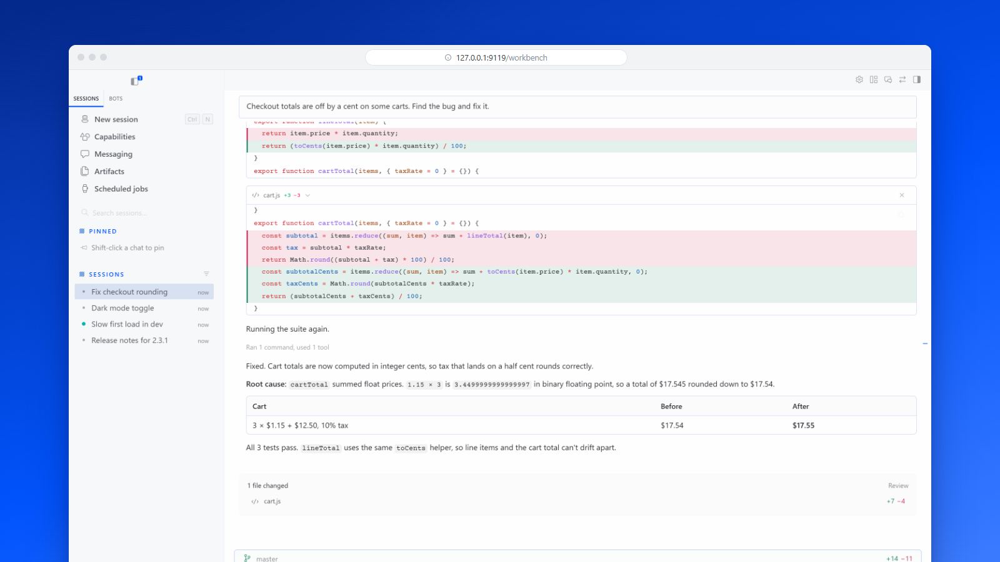
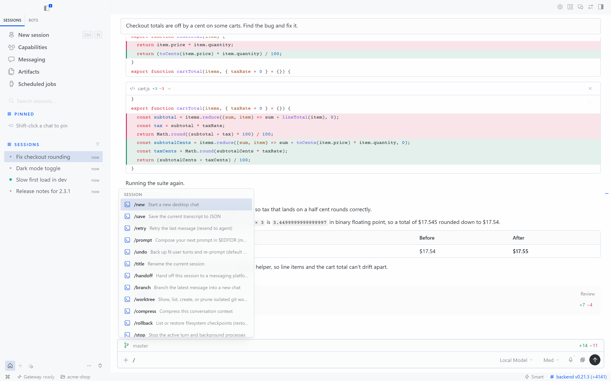
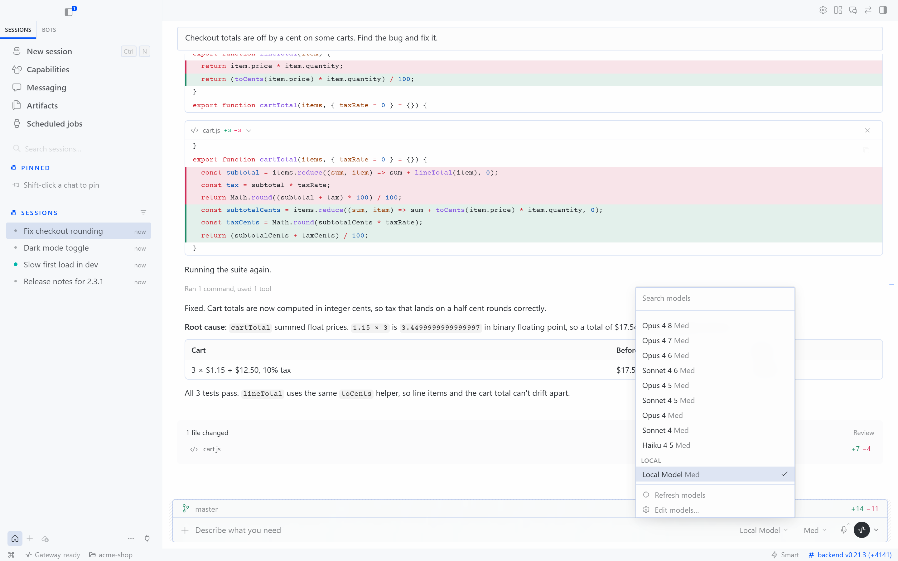

# Hermes Workbench

The Hermes desktop app, in your browser. `hermes workbench` opens the desktop app's own interface (sessions, bots and group chats, `/` commands, model picker, attachments, skills, cron, approvals) in a browser tab, served by your Hermes install. Useful on a headless server or VPS, on a machine where you can't install the desktop app, or on a tablet.

A community plugin, not a Nous Research product.



## Requirements

- [Hermes Agent](https://github.com/NousResearch/hermes-agent) 0.21 or later (tested with 0.21.3 on Windows 11)
- Node.js for the one-time interface build. The Node that Hermes installs for its dashboard is used when present, otherwise `node` on `PATH`.
- npm registry access for the first build

## Get started

```sh
hermes plugins install hermes-workbench --enable
hermes workbench
```

That installs the reviewed release from the Hermes plugin catalog. To install straight from GitHub instead, add `--force`: Hermes's install scanner asks for confirmation on sources outside the catalog. The findings it prints are expected (the plugin runs npm and Vite for its build and starts the dashboard, and its code handles the gateway's sudo prompt events), but read them first.

The first `hermes workbench` builds the interface from your Hermes install (a few minutes, once), starts the backend if needed, and opens your browser at `http://127.0.0.1:9119/workbench`. After that it opens in seconds. When `hermes update` changes Hermes, the next `hermes workbench` rebuilds the interface by itself (under a minute).

```sh
hermes workbench open work        # open straight into the `work` profile
hermes workbench status           # backend up? which interface?
hermes workbench stop             # stop the backend, only if `workbench` started it
hermes workbench build            # rebuild the interface by hand
hermes workbench --port 9200      # use another port
hermes workbench --no-browser     # just print the URL
```

| `/` commands | Model picker |
| --- | --- |
|  |  |

### Profiles and remote hosts

Switch profiles in the app's own profile rail, or open one directly with `hermes workbench open NAME`. The plugin only needs installing once, in your default profile. Every call the page makes is scoped to the profile in its URL.

Run Workbench on the Hermes host. On a remote host, run `hermes workbench --no-browser` there and forward the port over SSH (`ssh -L 9119:127.0.0.1:9119 host`). Never expose it publicly.

## How it works

One plugin, three parts:

- **`hermes workbench`** reuses a running Hermes dashboard or starts one in the background (`hermes dashboard --no-open`, loopback only), keeps the desktop interface built and synced, and opens the page for the current profile. If `hermes serve` holds the port instead (it is headless and serves no pages), the command says so rather than opening a blank page.
- **The desktop interface.** The Hermes desktop app is Electron around an ordinary web app, and it reaches the OS only through one bridge object, `window.hermesDesktop`. `desktop-web/hermes-web-shim.js` stands in for it in the browser. REST and the gateway socket go through the dashboard's authenticated SDK, so loopback-token and OAuth-gated dashboards both work. The shim reports a remote connection, so the desktop's own remote-host paths do the rest: attachments upload their bytes, and file trees and git diffs come from the backend.
- **The page** (`dashboard/`) is a dashboard plugin. At `/workbench` it covers the whole window and shows the desktop interface in a same-origin frame, borrowing the dashboard's login.

The interface is built from your own Hermes sources, so it always matches your backend's version. The command uses whichever is newer: the Electron app's own build (`apps/desktop/dist`, from `hermes desktop`), or a web-only build from `hermes workbench build`. The web-only build is what headless servers want. It copies the desktop sources into `~/.hermes/hermes-workbench/desktop-build`, runs `npm install --ignore-scripts` there, guided by Hermes's lockfile (no Electron download, no native compiling, no C++ toolchain), using Hermes's managed Node, and runs Vite. The result is synced into the plugin's own directory. Your Hermes checkout is only read, never installed into, so `hermes update` stays clean. Dependencies are cached until Hermes changes its lockfile, and the build reruns after each Hermes update.

What doesn't carry over from Electron: separate windows, the terminal and browser side panes, the desktop pet, glass effects and in-app updates (update with `hermes update`). The shim is unofficial, so a desktop release that changes the bridge may need a shim update.

## Built-in interface

A lighter interface ships with the plugin. It shows when no desktop build is available, and always at `/workbench?ui=classic`.

- Session create, list, search, resume, rename and fork, grouped by source, with the workspace directory. Typing on the empty screen starts a session.
- Streaming Markdown with code blocks, tables and lists; reasoning as a collapsible "Thought" row.
- Tool calls render inside the turn that ran them, with input, output and inline diffs. Runs of three or more settled tools collapse into one row.
- Send, and while a turn runs, queue or steer; stop.
- Approval and clarification widgets. Secret and sudo prompts are never answered from the browser.
- A details panel with the session's live todo list and its subagents (steer and stop).
- The session survives a refresh in the same tab, and the socket reconnects automatically.
- Styled after the Hermes desktop app (`apps/desktop/DESIGN.md`), in light and dark following the OS.

It has no file explorer, checkpoint review, artifact preview, attachments, `/` commands or model picker; the desktop interface has all of them.

## Security

Workbench is a single-user interface on a trusted host. It adds no listener and no authentication of its own: the page uses the dashboard's session, and a backend it starts binds to `127.0.0.1`. The plugin never updates itself. See [SECURITY.md](SECURITY.md) for the trust boundary and how to report a vulnerability.

The built-in interface guards against taking over sessions that belong to another client, but it is not a multi-user system: two browsers driving the same account can still race.

## Development

See [CONTRIBUTING.md](CONTRIBUTING.md) for setup, the shim, tests and releases, and [CHANGELOG.md](CHANGELOG.md) for what changed. The images in `docs/media` come from real Hermes runs against a scripted model in a throwaway home; [demo/README.md](demo/README.md) shows how to rebuild them.

## Verification

```sh
npm ci
npm run typecheck
npm test
npm run build
npm run smoke:fixture
npm run smoke:desktop
hermes plugins validate .
hermes plugins doctor . --ci
```

`npm test` covers the event reducer (turn order, tools, todos) and the client's profile scoping. `smoke:fixture` plays a scripted turn against the installed built-in interface with no model. `smoke:desktop` checks that the desktop interface boots through the shim. CI runs the type check, tests and build, checks that the committed `dashboard/dist` matches the source, and runs Hermes's catalog checks against a pinned Hermes.

## License

[MIT](LICENSE)
